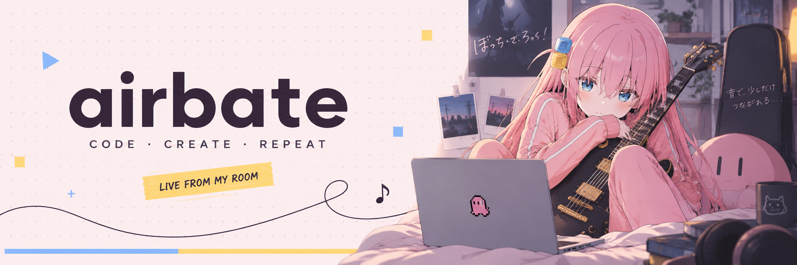

**AI 庄周是否梦到电子蝴蝶**

造工具 · 写文字 · 把 AI 接到真实世界

Building tools, writing words, connecting AI to the real world.

🎸 [SETLIST](#-setlist--项目歌单) · 🩷 [BACKSTAGE](#-backstage--关于我) · ✉️ [SAY HI](#-encore--联系)

社恐归社恐，commit 还是要交的。 / A little shy. Still shipping.

## 🩷 Backstage · 关于我

全栈开发者，写代码也写字。关注 **AI Agent、嵌入式与机器人、本地优先工具链**，喜欢把模型、软件和硬件接起来，做出能实际使用的东西。

维护微信公众号上的 AI 科普内容和 Obsidian 知识库，也写自动化工作流、折腾 WebGL 水墨效果，以及开源 AR 硬件。

I'm a full-stack developer working across **AI agents, embedded systems, robotics, and local-first tools**. My projects range from browser automation and desktop displays to robot perception and interactive graphics. I also write about AI and maintain an Obsidian knowledge base.

## 🎧 Soundcheck · 最近在做

- **AI 工作流**：用自然语言规划网页任务，让执行过程可审阅、可回放。
- **桌面硬件**：把待办、日程、Git 状态和 Agent 动态放到桌边的反射屏 / 墨水屏上。
- **应用原型**：化验单科普解释、报告趋势追踪，以及面向实际场景的 AI 工具。
- **知识与创作**：AI 科普、内容工作流、Obsidian，以及交互式水墨实验。

## 🎸 Setlist · 项目歌单

<table>
<tr>
<td width="50%" valign="top">

TRACK 01

### [Glance](https://github.com/airbate/Glance)

桌边的 AI 副屏，把待办、日程、Git 和 Agent 状态推到反射屏 / 墨水屏。

An ambient display for tasks & AI activity.

**ESP32 · C++ · Python · e-paper**

</td>
<td width="50%" valign="top">

TRACK 02

### [FlowPilot](https://github.com/airbate/flowpilot)

自然语言规划网页任务，支持审阅修改、实时执行、截图回放和 CSV 导出。

Reviewable plans. Replayable automation.

**FastAPI · React · Playwright · Nemotron**

</td>
</tr>
<tr>
<td width="50%" valign="top">

TRACK 03

### [LabLens](https://github.com/airbate/lablens)

化验单指标识别、通俗解释和多次报告趋势追踪；只做科普与辅助，不提供诊断。

Understand lab reports. Track changes.

**Python · OCR · FastAPI · SQLite**

</td>
<td width="50%" valign="top">

TRACK 04

### [LIMO Person Following](https://github.com/airbate/limo-person-following)

从行人检测与深度定位，到带限速和看门狗的机器人跟随控制。

Visual perception meets motion control.

**ROS · OpenCV · MobileNet-SSD**

</td>
</tr>
<tr>
<td width="50%" valign="top">

TRACK 05

### [水墨流韵 · Ink Flow](https://github.com/airbate/shuimo-liuyun)

浏览器里的交互式水墨模拟，让流体计算带一点艺术感。

Chinese ink, flowing through WebGL.

**WebGL · GLSL · Stable Fluids**

</td>
<td width="50%" valign="top">

TRACK 06

### [个人博客 · Field Notes](https://github.com/airbate/ideal-octo-adventure)

记录技术探索、AI 科普与创作。工具之外，也留一点文字。

Experiments, stories & things learned.

**Astro · TypeScript · Tailwind CSS**

</td>
</tr>
</table>

More experiments · 其他探索

- [mushen / 赛博半仙](https://github.com/airbate/mushen)：基于 Numerologist_skills 的 AI 命理应用探索。
- [Numerologist_skills](https://github.com/airbate/Numerologist_skills)（fork）：用固定步骤与计算流程约束奇门、紫微和八字排盘。
- [Project North Star](https://github.com/airbate/ProjectNorthStar)（fork）：开源 AR 头显硬件探索。
- [微信做题小程序](https://github.com/airbate/wechat-program)：基于微信平台的线上做题工具。

## 🎛️ Pedalboard · 常用工具

| 方向 | 技术 |
| --- | --- |
| AI 与自动化 | Python · Agent workflows · Claude Code / Codex · Playwright |
| Web 与应用 | TypeScript · React · Node.js · FastAPI · Astro |
| 硬件与机器人 | C / C++ · ESP32 · ROS · OpenCV |
| 图形与知识管理 | WebGL · GLSL · Obsidian |

## ✉️ Encore · 联系

[Email](mailto:qw20060930qw@163.com) · [Blog](https://ideal-octo-adventure.vercel.app) · [X / @airbate](https://x.com/airbate)

欢迎交流 AI Agent、嵌入式、机器人和创作工具。

---

 
🎸 One more commit before the encore. 工具要复利，笔记要会思考，AI 干该干的活。 Updated · 2026-10-05 · Unofficial Bocchi fan theme

